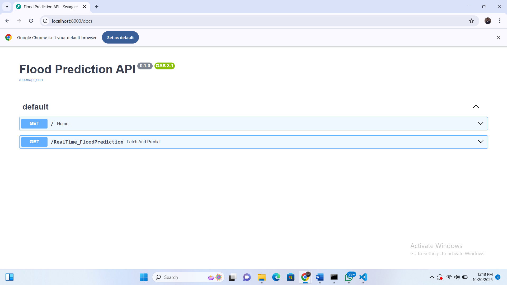
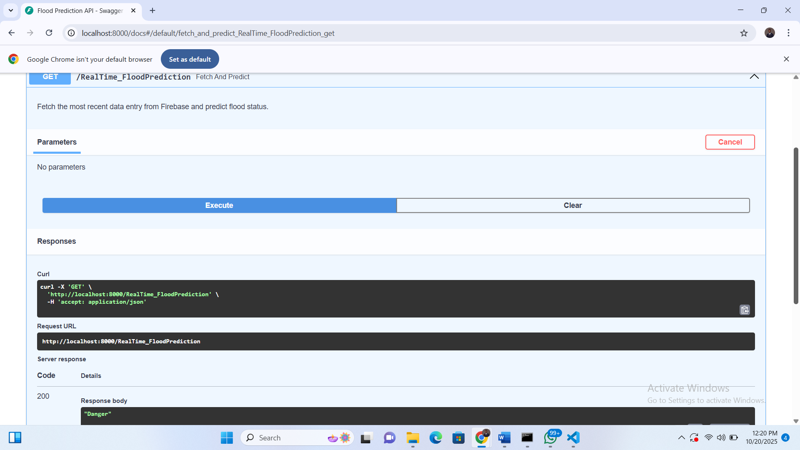

Flood Risk Classification API

Machine Learning Model Deployment with FastAPI

**Overview**

This repository contains the implementation of a *Flood Risk Classification Model*, developed to predict the likelihood of flooding in riverine communities using environmental and sensor data.

The model serves as the analytical core of the *Flood Alert System*, complementing IoT hardware by interpreting sensor readings (such as water level, temperature, and humidity) to classify risk levels as Low, Moderate, or High.

**Technology Stack**

Programming Language: Python 3.10+

Machine Learning Algorithms: Logistic Regression, Random Forest, XGBoost, CatBoost

Libraries: pandas, numpy, scikit-learn, xgboost, catboost, joblib

API Framework: FastAPI

Model Serving: Uvicorn (ASGI server)

